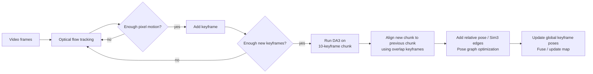
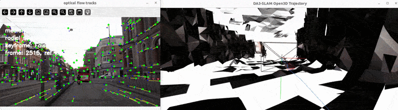
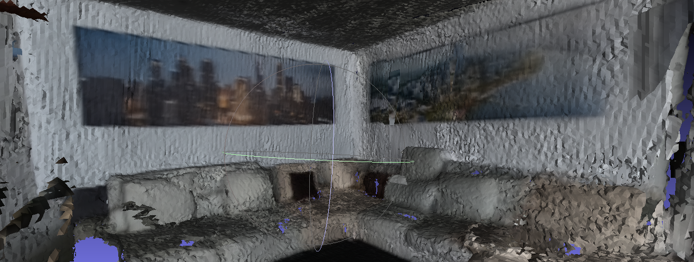

# Easy DA3

# Build environment

```
pip install -r requirement.txt
```

# Run DA3 triton server

Download https://github.com/MapMindAI/EasyTensorRT, and run the server with :

```
./run_server_trt.sh
```

Docker image will be downloaded, onnx model will be transformed to triton plan file.

# DA3 VO

visual odometry using depthanything 3
* optical flow to get keyframes.
* run DA3 for all key frames if new keyframes (half DA3 input images size) added.

**Use optical-flow VO as the real-time frontend, and use DA3 as a delayed local-geometry backend.**
DA3 should generate high-quality depth/pose constraints per chunk; pose graph optimization will integrate those constraints globally.

DA3 is suitable for this because it predicts spatially consistent geometry from arbitrary visual inputs, with or without known camera poses, and the official DA3-Streaming code is explicitly designed for long videos through chunk streaming under limited GPU memory.






# DA3 MVS

This project runs DepthAnything3 on multi-view image sets by using a COLMAP sparse reconstruction to get camera intrinsics and extrinsics, sending image chunks to a Triton inference server, and saving predicted depth maps, confidence maps, and visualizations. It can also fuse the predicted RGB-D results into a 3D mesh using Open3D TSDF. The main script is da3_client.py, which loads COLMAP data, chunks related views, prepares poses and resized camera parameters, runs Triton inference, rescales outputs, and writes results; optional mesh generation is done with fuse_rgbd_tsdf.py.

* The test colmap model and result is uploaded into [google drive colmap test dataset](https://drive.google.com/file/d/1Rnii_aOKjACx39L7C8yBzM7uvx6-MbQB/view?usp=drive_link)
* Use the DA3 model with poses input https://github.com/MapMindAI/EasyTensorRT/pull/6
* [See detailed read me](da3_mvs/README.md)

```
SESSION_FOLDER=../EasyGaussianSplatting/data/gopro_test

python da3_mvs/da3_client.py \
--triton-url 0.0.0.0:8001 \
--colmap-model-dir ${SESSION_FOLDER}/sparse/0 \
--image-dir ${SESSION_FOLDER}/images \
--output-dir ${SESSION_FOLDER}/da3 \
--chunk-size 10 \
--min-shared-points 20

python da3_mvs/fuse_rgbd_tsdf.py \
--colmap-model-dir ${SESSION_FOLDER}/sparse/0 \
--image-dir ${SESSION_FOLDER}/images \
--depth-dir ${SESSION_FOLDER}/da3/depth \
--conf-dir ${SESSION_FOLDER}/da3/depth_conf \
--output-mesh ${SESSION_FOLDER}/da3/mesh.ply \
--conf-threshold 2.0
```




# DA3 stereo depth
