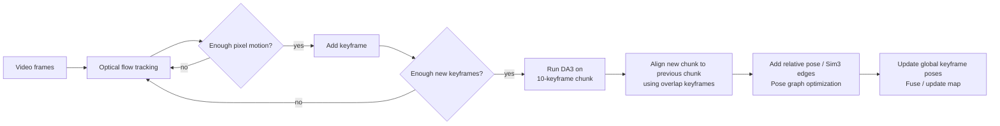

# EasyLocalization

easy localization lib

# DA3 VO

visual odometry using depthanything 3

* optical flow to get keyframes.
* run DA3 for all key frames if new keyframes (half DA3 input images size) added.

**Use optical-flow VO as the real-time frontend, and use DA3 as a delayed local-geometry backend.**
DA3 should generate high-quality depth/pose constraints per chunk; pose graph optimization will integrate those constraints globally.

DA3 is suitable for this because it predicts spatially consistent geometry from arbitrary visual inputs, with or without known camera poses, and the official DA3-Streaming code is explicitly designed for long videos through chunk streaming under limited GPU memory.

